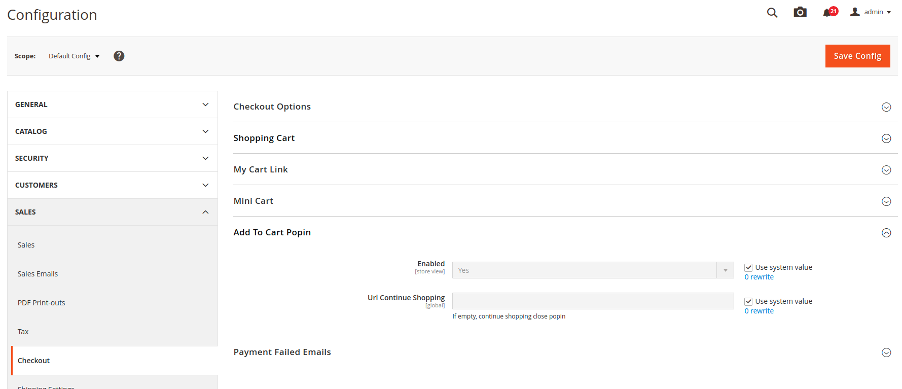
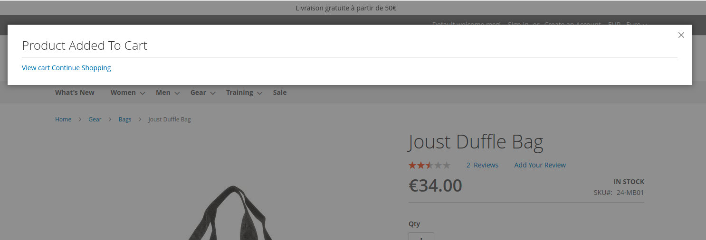

# m2-addtocartpopin : documentation

## BO

## FO

## Ajout d'element dans la popin

Ajouter un fichier layout "addtocartpopin_product_view.xml" et inserer vos instructions dans un des deux conteneurs
- add-to-cart.popin.before : Avant les boutons
- add-to-cart.popin.after : Apres les boutons